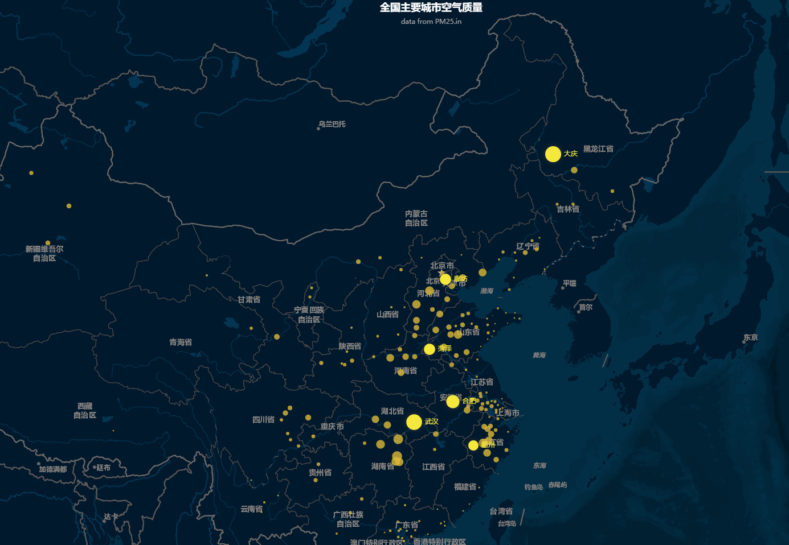
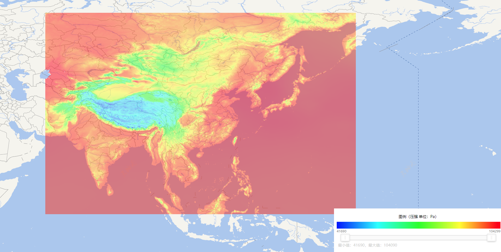

## 目录

##### 🌐 [投影坐标系](#1投影坐标系)
##### 🍀 [大量点问题](#2大量点数据解决方案)
##### 🎨 [栅格数据渲染](#3栅格数据渲染)
##### 🏀 前端读取TIFF画图（d3）
##### 🌀 矢量风动画
##### 🚀 自定义图层在VUE使用中


#### 1.投影坐标系
   [天地图](http://lbs.tianditu.gov.cn/server/MapService.html)提供的底图投影主要包括两种经纬度投影、球面墨卡托投影。
   分别对应EPSG Code为EPSG:4326、EPSG:3857
   
   * 经纬度投影(4326):
       <div align="center">
           
       </div>

   
   * 球面墨卡托投影(3857):  
   
   
   Leaflet.js默认投影为球面墨卡托投影，修改默认投影:  
   ```javascript
    new L.Map('map', {center: new L.LatLng(30.5, 110.51),
                       zoom: 4,
                       crs: L.CRS.EPSG4326
                   });
   ```

   
#### 2.大量点数据解决方案
   默认的leaflet.js渲染点通过基于DOM的svg方式，大量的点(或者重复动画)造成页面卡顿甚至崩溃。
leaflet API 提供以canvas形式渲染。
    
   ```javascript
    var map = L.map('map', {
        preferCanvas: true
    });
    var circleMarker = L.circleMarker(latLng, {
        color: '#3388ff'
    }).addTo(map);
   ```
   > 或者
 ```javascript
    var map = L.map('map');
    var myRenderer = L.canvas({ padding: 0.5 });
    var circleMarker = L.circleMarker(latLng, {
        renderer: myRenderer,
        color: '#3388ff'
    }).addTo(map);
   ```
   > 此外，使用这种方式渲染点，Leaflet仍会跟踪鼠标位置来触发相关Circle Marker事件
   
   可以使用leaflet中加载echarts图层，既可以满足渲染速度，同时也可以使用echarts中炫酷的效果、tooltips等功能。
   关于此功能，可以参考[leaflet-echarts.js](lib/leaflet-echarts.js)(待完善)，自定义leaflet图层对象。
   
   echarts option需要如下配置
   ```javascript
   option = {
     geo:{},
     series:[{
         coordinateSystem: 'geo',
         data:data
     }
     ]
   }
    
```
   然后创建leaflet图层，在图层的container 上绘制echarts的内容
   ```javascript
       //创建图层
       var layer =  new L.EchartsLayer(map, echarts);
       //创建echarts container
       var container = layer.getEchartsContainer();
       layer.initECharts(container);
       layer.setOption(option);
```
   根据echarts官网散点图实例的[DEMO](https://piemonsong.github.io/um_solution/leaflet_tips/example/leaflet-echarts.html)
    <div>
        
    </div>
#### 3.栅格数据渲染

   格点场渲染，只要是请求读取tiff数据，通过[georaster-layer-for-leaflet](https://github.com/GeoTIFF/georaster-layer-for-leaflet)资源库实现的。
   目前版本只适用于经纬度投影，墨卡托投影在地图范围较大时候产生很大偏差。这个资源库保留tiff数据格点大小，因此放大地图会有像素块显示。
   > 解决方式通过前端插值方式
   
   默认是通过canvas切片每个点经纬度坐标获取在tiff栅格上位置，向下取整获得位置(x,y)，根据(x,y)来获取数据值
  ```javascript
    // pixelWidth*pixelHeight tiff
    let x_in_raster_pixels = Math.floor( (lng - xmin) / pixelWidth );
    let y_in_raster_pixels = Math.floor( (ymax - lat) / pixelHeight );
    raster[y_in_raster_pixels][x_in_raster_pixels]
```
   改为插值获取数据(采用双线性插值方式)
   ```javascript
    interpolatedValueAtIndexes((lng - xmin) / pixelWidth,(ymax - lat) / pixelHeight)
    
    function interpolatedValueAtIndexes(i,j){
            const raster = this._rasters[0]
            let tiff_width = this._tiff_width
            let tiff_height = this._tiff_height;
            let fi,fj,ci,cj
            let g00, g10, g01, g11
            if(i >= tiff_width - 1){
              fi = ci =  tiff_width - 1
            }else{
              fi = Math.floor(i)
              ci = fi + 1
            }
            if(j >= tiff_height - 1){
              fj = cj =  tiff_height - 1
            }else{
              fj = Math.floor(j)
              cj = fj + 1
            }
            const row0 = raster[fj]
              g00 = row0[fi]
              g10 = row0[ci];
    
          const row1 = raster[cj]
    
          g01 = row1[fi]
          g11 = row1[ci];
          return this._doInterpolation(i-fi,j-fj,g00, g10, g01, g11)
        }
          /**
           * Bilinear interpolation for Number
           * https://en.wikipedia.org/wiki/Bilinear_interpolation
           * @param   {Number} x
           * @param   {Number} y
           * @param   {Number} g00
           * @param   {Number} g10
           * @param   {Number} g01
           * @param   {Number} g11
           * @returns {Number}
           */
          function _doInterpolation(x, y, g00, g10, g01, g11) {
            var rx = 1 - x;
            var ry = 1 - y;
            return g00 * rx * ry + g10 * x * ry + g01 * rx * y + g11 * x * y;
          }
  ```
   修改后js文件后见[georaster-layer-for-leaflet_interpotation.bundle](lib/georaster-layer-for-leaflet_interpotation.bundle.js)
   
   展示[DEMO](https://piemonsong.github.io/um_solution/leaflet_tips/example/leaflet-tiff.html)
   <div>
    
   </div>
   
   #####4.前端读取TIFF d3画图
   [geotiff.js](#https://geotiffjs.github.io/) 可以客户端js读取各类GeoTIFF格式的metadata和raw array data,可以用[d3.js](#https://d3js.org/)
   将带有地理信息的栅格数据，动态绘制。
   
   
   