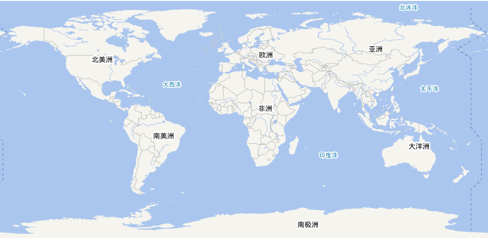
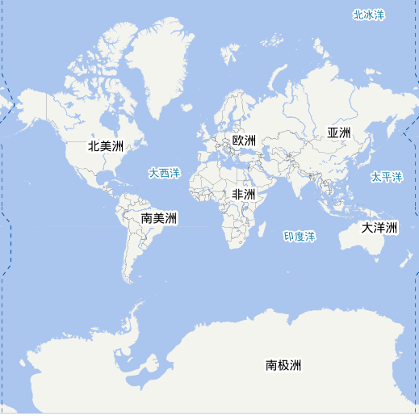

## 目录

##### 🌐 [投影坐标系](#投影坐标系)
##### 🍀 大量点问题
##### 🎨 格点场渲染
##### 🌀 矢量风动画
##### 🚀 自定义图层在VUE使用中
##### 🏀 前端读取TIFF画图（d3）


#### 一. 投影坐标系
   [天地图](http://lbs.tianditu.gov.cn/server/MapService.html)提供的底图投影主要包括两种经纬度投影、球面墨卡托投影。
   分别对应EPSG Code为EPSG:4326、EPSG:3857
   
   * 经纬度投影(4326):
       <div align="center">
           
       </div>

   
   * 球面墨卡托投影(3857):  
   
   
   Leaflet.js默认投影为球面墨卡托投影，修改默认投影:  
   ```javascript
    new L.Map('map', {center: new L.LatLng(30.5, 110.51),
                       zoom: 4,
                       crs: L.CRS.EPSG4326
                   });
   ```

   
#### 2.大量点数据解决方案
   默认的leaflet.js渲染点通过基于DOM的svg方式，大量的点(或者重复动画)造成页面卡顿甚至崩溃。
leaflet API 提供以canvas形式渲染。
    
   ```javascript
    var map = L.map('map', {
        preferCanvas: true
    });
    var circleMarker = L.circleMarker(latLng, {
        color: '#3388ff'
    }).addTo(map);
   ```
   > 或者
 ```javascript
    var map = L.map('map');
    var myRenderer = L.canvas({ padding: 0.5 });
    var circleMarker = L.circleMarker(latLng, {
        renderer: myRenderer,
        color: '#3388ff'
    }).addTo(map);
   ```
   > 此外，使用这种方式渲染点，Leaflet仍会跟踪鼠标位置来触发相关Circle Marker事件
   
   可以使用leaflet中加载echarts图层，既可以满足渲染速度，同时也可以使用echarts中炫酷的效果、tooltips等功能
   